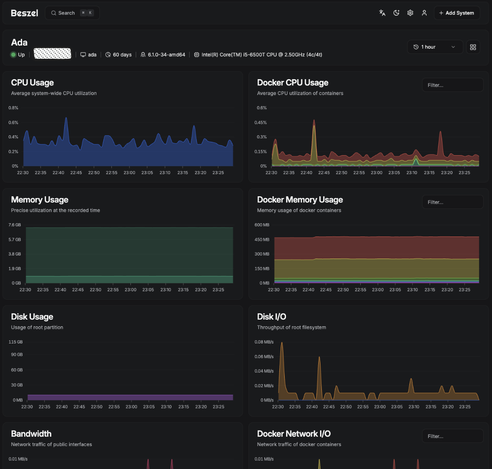
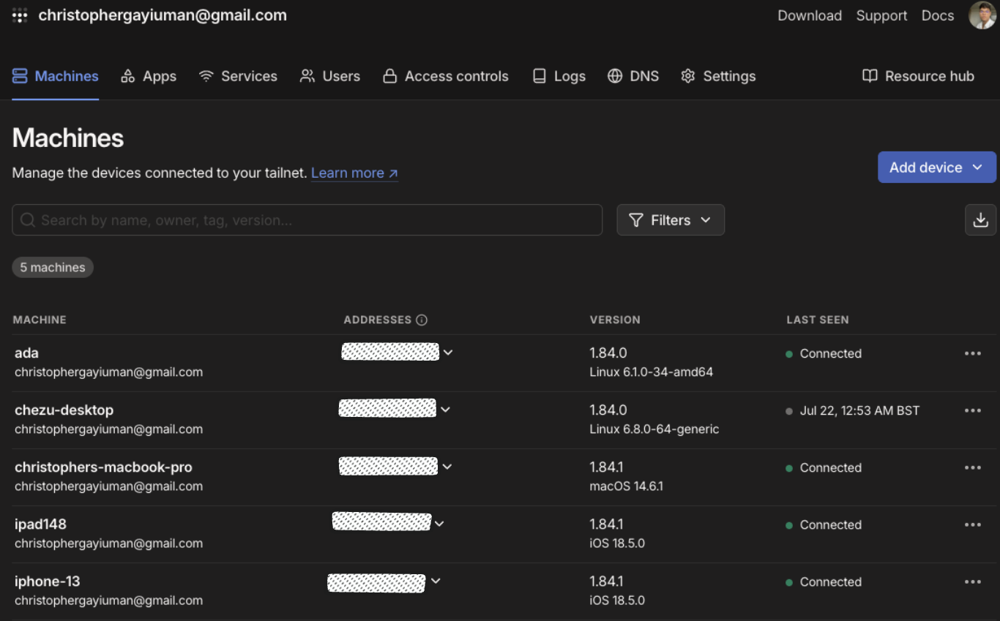

# 🏠 Ada Homelab

Welcome to my homelab showcase! This repository is less about code and more about the systems and tools I've set up to manage my personal tech infrastructure. It's a space where I experiment, optimise, and learn — all while making my digital life more private, efficient, and enjoyable.

## ✨ Highlights

Here’s a breakdown of what I’ve built and manage within my homelab:

### 🧠 System Monitoring
- Multi-container monitoring using **[Beszel](https://beszel.dev/)**, **[Docker Compose](https://docs.docker.com/compose/)**
- Real-time metrics across all services
- Custom dashboards for CPU, memory, disk, and container health

### 📱 Device Management
- Centralised management for all personal tech devices (laptops, phones, Raspberry Pis, etc.) **[Tailscale](https://tailscale.com/)**
- Automated patching, backups, and configuration sync

### 🌐 DNS & Networking
- Custom DNS dashboard with per-device routing
- Self-hosted **Pi-hole** or **AdGuard Home** for ad/tracker blocking
- Internal domain names for all local services
- DNS-based VPN routing and filtering

### 🌍 Web Hosting
- Hosting my [personal website](https://cgym.dev) from within the lab
- HTTPS via internal reverse proxy (Nginx, Docker)
- CI/CD with GitHub Actions for updates

### 📚 Ebook Repository
- Hosting my [Port Alexandria](https://portalexandria.net/) from within the lab
- Organised self-hosted digital library
- Accessible via internal web UI and e-reader sync
- Full offline support

### 🎬 Media Center
- Fully offline video downloading and streaming
- Self-hosted media centre with Plex / Jellyfin
- Automated downloads and metadata scraping

### 🌍 Ada Homepage 
- Custom nginx docker server running a homepage for useful links
- Closed intranet page only accessable inside of the network
- Built for iphone homescreen compatability 

---

## 🧰 Tech Stack

| Area              | Tools Used                             |
|-------------------|----------------------------------------|
| Monitoring        | Beszel                                 |
| DNS & Networking  | Cloudflare Custom DNS, Tailscale,      |
| File Sharing      | Taildrop                               |
| Media             | Jellyfin, qBittorrent, yt-dlp          |
| Hosting           | Nginx, Docker, GitHub Actions          |
| Device Mgmt       | Tailscale                              |

---

## 📷 Screenshots

All screenshots are available in the [`/images`](./images) directory.

> *(More coming soon as I document everything!)*

---

## 🧪 Why I Built This

- To learn infrastructure tools hands-on
- To reduce reliance on cloud services
- To create a self-hosted, privacy-respecting digital environment
- To manage and automate everything from a central point

---

## 🚀 Future Plans

- Add HA (High Availability) with failover
- Set up Kubernetes (or k3s) for container orchestration
- Create automated backups to cold storage
- Integrate smart home devices

---

## 🗂️ Repo Structure

This repo mainly contains:
- 📸 Screenshots
- 📚 Documentation on each component (coming soon)

---

## 🙌 Contributions

This is a personal project, but feel free to open an issue or suggest improvements if you’re building something similar!

---

## 📬 Contact

If you're interested in discussing homelabs, automation, or want help building your own setup:

- Email: `christophergayiuman@gmail.com`
- Website: [https://cgym.dev](https://cgym.dev)

---

*Thanks for stopping by! 👋*
